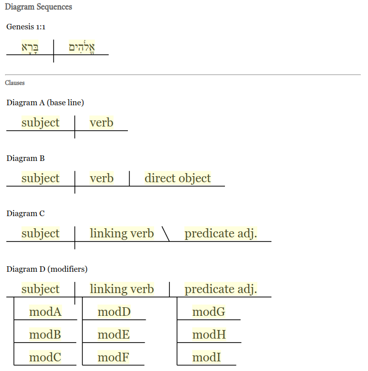

# Gedeonix Diagram Sentences Lib (d3 + svg)

Library for presenting sentence diagrams.

## Demo
 Simple demo in ./public/diagram.html file.

 
 
## Resource
- https://en.wikipedia.org/wiki/Sentence_diagram

### SBL Fonts
The project (non-profit) uses fonts from www.sbl-site.org
under license
> Fonts SBL fonts are made available without cost to individual scholars for non-profit use.
>
> www.sbl-site.org/educational/biblicalfonts.aspx